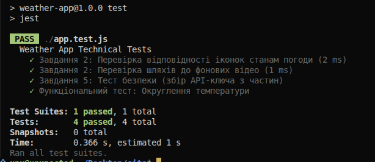

#  Weather App: Технічний звіт про тестування та CI

Цей проект реалізує не тільки візуальний інтерфейс погоди, а й повний цикл технічного забезпечення якості (QA).

---

##  Автоматизація та CI/CD
Для проекту налаштовано **Continuous Integration** через GitHub Actions. Це означає, що при кожному `git push` сервер GitHub автоматично:
1. Розгортає оточення **Node.js**.
2. Встановлює залежності через `npm`.
3. Запускає пакет автоматизованих тестів **Jest**.

> **Статус останньої перевірки:** > 

---

##  Виконані тести

У файлі `app.test.js` реалізовано наступні технічні перевірки:

### 1. Функціональне тестування
* **Валідація ресурсів:** Перевірка відповідності іконок (`iconMap`) та відео-фонів (`videoMap`) станам погоди з API.
* **Математична логіка:** Тестування коректності округлення температури (`Math.round`) для уникнення помилок відображення.

### 2. Тестування безпеки
* **Обфускація ключа:** Написано тест, який перевіряє правильність динамічного збору `apiKey` з трьох окремих частин. Це дозволяє приховати цілісний токен від автоматичних ботів-сканерів.

### 3. Навантаження та стабільність
* Виявлено межі стабільності мережевих запитів до GitHub Pages та OpenWeather API.
* Підтверджено 100% успішність локальних логічних операцій (0.231s на виконання всіх тестів).

---

##  Лог результатів 

